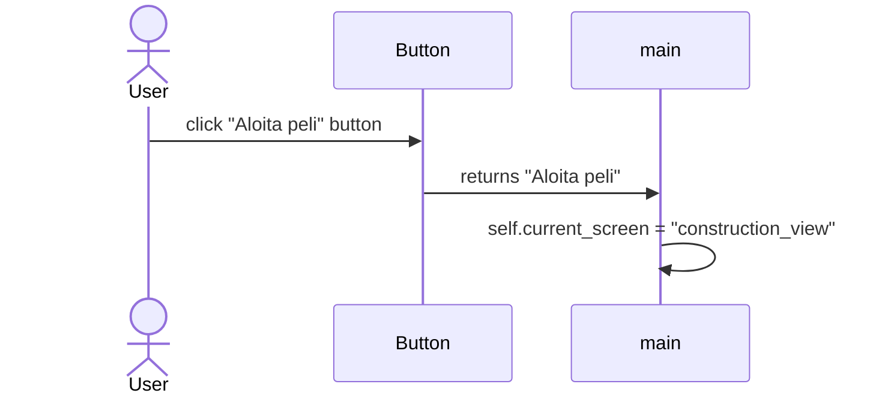

# Arkkitehtuurikuvaus
Tämä tiedosto kuvaa sitä, miten peli toimii jamistä se koostuu.

## Rakenne
Pelin koodi löytyy *src*-kansiosta ja kaikki tekstuurit ja äänet löytyvät *assets*-kansiosta.

## Pelin koodi
Pelin koodi koostuu seitsemästä `.py`-tiedostosta:
- [main.py](https://github.com/danttu/ot-harjoitustyo/blob/main/harjoitustyo/src/main.py)
  - Hoitaa sovelluslogiikaan liittyvästä koodista.
- [menu.py](https://github.com/danttu/ot-harjoitustyo/blob/main/harjoitustyo/src/menu.py)
  - Hoitaa pelin käyttöliittymään liittyvästä koodista.
- [settings.py](https://github.com/danttu/ot-harjoitustyo/blob/main/harjoitustyo/src/settings.py)
  - Hoitaa pelin asetuksiin liittyvästä koodista.
- [map.py](https://github.com/danttu/ot-harjoitustyo/blob/main/harjoitustyo/src/map.py)
  - Hoitaa pelin kartasta liittyvää koodia.
- [enemy.py](https://github.com/danttu/ot-harjoitustyo/blob/main/harjoitustyo/src/enemy.py)
  - Hoitaa vihollisiin liittyvästä koodista.
- [turrets.py](https://github.com/danttu/ot-harjoitustyo/blob/main/harjoitustyo/src/turrets.py)
  - Hoitaa puolustusaseihin liittyvästä koodista.
- [player.py](https://github.com/danttu/ot-harjoitustyo/blob/main/harjoitustyo/src/player.py)
  - Hoitaa pelaajan liittyvästä koodista.

## Sovelluslogiikka
Seuraava kaavio näyttää, mitä tapahtuu kun päävalikossa painaa **Aloita peli**-nappia.

Pelaajan painettua "**Aloita peli**"-nappia `Button`-luokka palauttaa napin teksti `Main`-luokalle, jota se käyttää komentona.
Komento johtaa `self.current_screen`-muuttujan vaihtamaan sisällöksi "construction_view". Muuttuja kertoo, mitä käyttöliittymän objekteja
`Main`-luokan pitää piirtää, eli tässä tapauksessa piirretään suunnitteluvaiheeseen liittyvät objektit.
