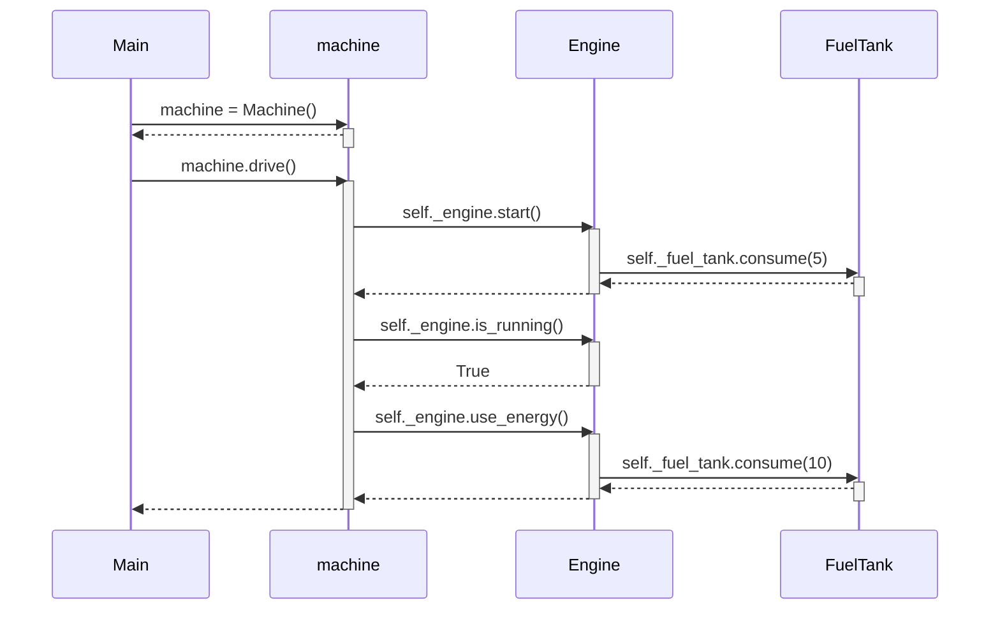

## Sekvenssikaavio

```mermaid
sequenceDiagram
    Main->>machine: machine = Machine()
    activate machine
    machine-->>Main: 
    deactivate machine
    Main->>machine: machine.drive()
    activate machine
    machine->>Engine: self._engine.start()
    activate Engine
    Engine->>FuelTank: self._fuel_tank.consume(5)
    activate FuelTank
    FuelTank-->>Engine:  
    deactivate FuelTank
    Engine-->>machine:  
    deactivate Engine
    machine->>Engine: self._engine.is_running()
    activate Engine
    Engine-->>machine: True
    deactivate Engine
    machine->>Engine: self._engine.use_energy()
    activate Engine
    Engine->>FuelTank: self._fuel_tank.consume(10)
    activate FuelTank
    FuelTank-->>Engine: 
    deactivate FuelTank
    Engine-->>machine: 
    deactivate Engine
    machine-->>Main: 
    deactivate machine
```