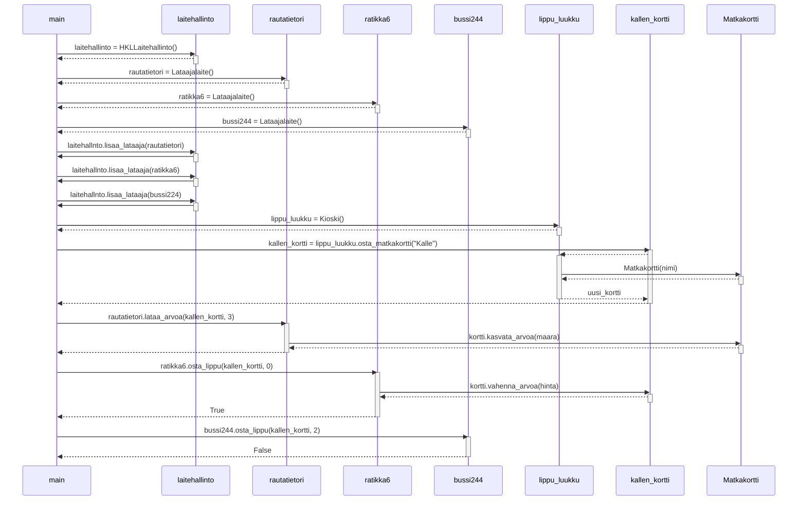

## Sekvenssikaavio HSL

```mermaid
sequenceDiagram
    main->>laitehallinto: laitehallinto = HKLLaitehallinto()
    activate laitehallinto
    laitehallinto-->>main: 
    deactivate laitehallinto
    main->>rautatietori: rautatietori = Lataajalaite()
    activate rautatietori
    rautatietori-->>main: 
    deactivate rautatietori
    main->>ratikka6: ratikka6 = Lataajalaite()
    activate ratikka6
    ratikka6-->>main: 
    deactivate ratikka6
    main->>bussi244: bussi244 = Lataajalaite()
    activate bussi244
    bussi244-->>main: 
    deactivate bussi244
    main->>laitehallinto: laitehallnto.lisaa_lataaja(rautatietori)
    activate laitehallinto
    laitehallinto->>main: 
    deactivate laitehallinto
    main->>laitehallinto: laitehallnto.lisaa_lataaja(ratikka6)
    activate laitehallinto
    laitehallinto->>main: 
    deactivate laitehallinto
    main->>laitehallinto: laitehallnto.lisaa_lataaja(bussi224)
    activate laitehallinto
    laitehallinto->>main: 
    deactivate laitehallinto
    main->>lippu_luukku: lippu_luukku = Kioski()
    activate lippu_luukku
    lippu_luukku-->>main: 
    deactivate lippu_luukku
    main->>kallen_kortti: kallen_kortti = lippu_luukku.osta_matkakortti("Kalle")
    activate kallen_kortti
    kallen_kortti-->>lippu_luukku: 
    activate lippu_luukku
    lippu_luukku->>Matkakortti: Matkakortti(nimi)
    activate Matkakortti
    Matkakortti-->>lippu_luukku: 
    deactivate Matkakortti
    lippu_luukku-->>kallen_kortti: uusi_kortti
    deactivate lippu_luukku
    kallen_kortti-->>main: 
    deactivate kallen_kortti
    main->>rautatietori: rautatietori.lataa_arvoa(kallen_kortti, 3)
    activate rautatietori
    rautatietori->>Matkakortti: kortti.kasvata_arvoa(maara)
    activate Matkakortti
    Matkakortti-->>rautatietori: 
    deactivate Matkakortti
    rautatietori-->>main: 
    deactivate rautatietori
    main->>ratikka6: ratikka6.osta_lippu(kallen_kortti, 0)
    activate ratikka6
    ratikka6->>kallen_kortti: kortti.vahenna_arvoa(hinta)
    activate kallen_kortti
    kallen_kortti-->>ratikka6: 
    deactivate kallen_kortti
    ratikka6-->>main: True
    deactivate ratikka6
    main->>bussi244: bussi244.osta_lippu(kallen_kortti, 2)
    activate bussi244
    bussi244-->>main: False
    deactivate bussi244
```